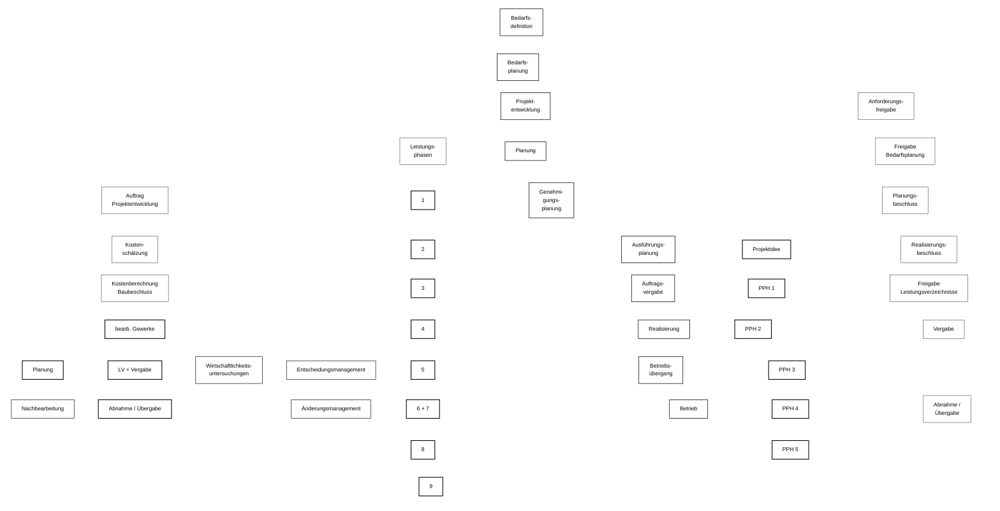

# Projektphasen-Diagramm (Mermaid)

## Hinweis
GitHub erzwingt je nach Oberfläche oft einen dunklen Mermaid-Hintergrund.  
Darum sind jetzt **alle Texte und Balken in weißen Boxen mit schwarzer Schrift** gesetzt, damit nichts mehr „verschwindet“.
